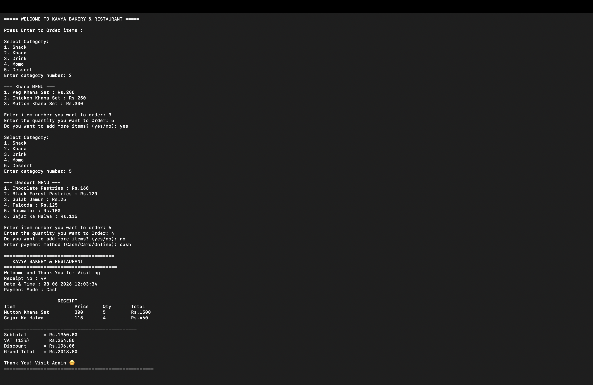

# 🍽️ Restaurant Management System

A Python-based Restaurant Management System that simulates real-world restaurant operations like ordering, billing, menu management, and business analytics.

## 📌 Features
- Customer order processing
- Dynamic menu management (Add / Remove / Update items)
- Automated billing system
- VAT and discount calculation
- Admin dashboard with authentication
- Sales analytics and reporting
- Customer and visitor tracking
- Receipt generation system
- Data persistence using JSON and text files

## 🛠️ Technologies Used
- Python
- JSON
- File Handling

## 📊 Project Highlights
- Real-time order and billing system
- Admin panel for restaurant management
- Sales and revenue tracking system
- Printable receipts generated automatically

## 🚀 How to Run
```bash
python Menu.py

## 🖥️ Output


